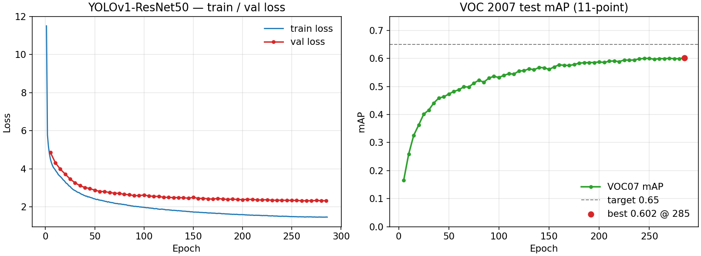
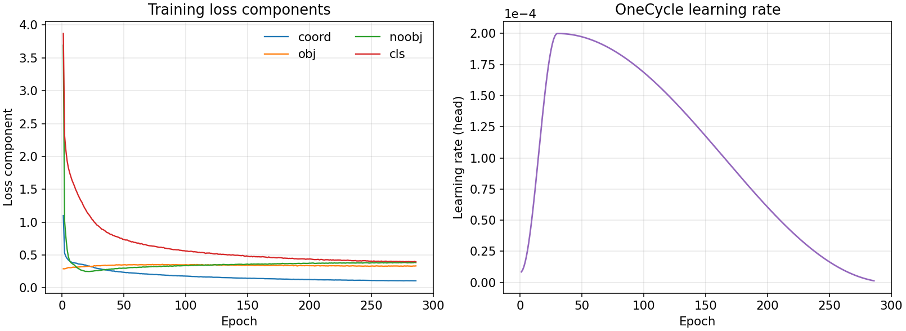
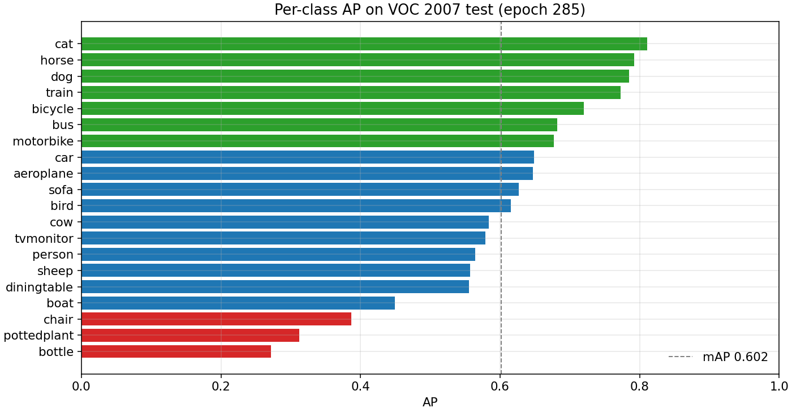

# YOLOv1 (PyTorch)

PyTorch re-implementation of YOLOv1 for PASCAL VOC 2007 + 2012, following
[You Only Look Once](https://arxiv.org/abs/1506.02640) and the training /
inference pipeline in [arXiv:2305.17786](https://arxiv.org/pdf/2305.17786v1).

## Setup

```bash
conda activate yolo
cd /home/libing/source/ml/yolo/learning_yolo
```

VOC is downloaded to `~/dataset/VOC`:

```bash
python -m yolo_v1.voc_download --root ~/dataset/VOC
```

## Train

```bash
# ImageNet-pretrained ResNet50 backbone (recommended)
python train.py --data-root ~/dataset/VOC --model resnet50 --epochs 300 \
  --batch-size 32 --lr 1e-3 --backbone-lr-mult 0.2 --no-extra-aug \
  --target-map 0.65 --output runs/yolov1_r50

# ResNet18 / original Darknet-style YOLOv1 / tiny
python train.py --data-root ~/dataset/VOC --model resnet18 --epochs 100 --batch-size 32 --output runs/yolov1_r18
python train.py --data-root ~/dataset/VOC --model yolov1 --epochs 135 --batch-size 16
python train.py --data-root ~/dataset/VOC --model tiny --epochs 200 --batch-size 32 --output runs/yolov1-tiny
```

Training uses VOC 2007+2012 `trainval`, evaluates VOC 2007 `test` mAP (11-point),
SGD + OneCycle, mixed precision, and the original YOLO multi-part SSE loss.

## Evaluate / detect

```bash
python evaluate.py --ckpt runs/yolov1_r50/best.pt --data-root ~/dataset/VOC
python detect.py --ckpt runs/yolov1_r50/best.pt --source /path/to/image.jpg --out outputs/detect
python plot_curves.py --run runs/yolov1_r50
```

---

## Experiment: ResNet50 (`runs/yolov1_r50`)

### Motivation

The from-scratch Darknet-style YOLOv1 (~272M params, large 4096-d FC) trained
slowly and stalled near **mAP ≈ 0.08**. An ImageNet-pretrained ResNet18 run
reached **mAP ≈ 0.45** and then plateaued. This experiment swaps in a stronger
ImageNet backbone and milder augmentations, with early stop at **mAP ≥ 0.65**.

### Setup

| Item | Value |
|---|---|
| Backbone | ResNet50 (`IMAGENET1K_V1`) + YOLOv1 `7×7×30` head |
| Params | 114.2M |
| Data | VOC07+12 trainval **16,551** / VOC07 test **4,952** |
| Input | 448×448, ImageNet mean/std |
| Optimizer | SGD momentum 0.9, weight decay 5e-4, AMP |
| LR | OneCycle, head `1e-3`, backbone `2e-4` (`backbone_lr_mult=0.2`) |
| Batch / epochs | 32 / planned 300 (stopped at 286) |
| Augmentation | color jitter + horizontal flip + YOLO jitter (no rotation / vflip) |
| Eval | every 5 epochs, score thresh `0.001`, VOC07 11-point mAP |
| Target | mAP **0.65** (not reached) |

### Result

| Metric | Value |
|---|---|
| Best mAP | **0.6019** @ epoch **285** |
| Final train loss | 1.469 (epoch 286) |
| Best val loss | ≈ 2.328 |
| Status | Interrupted at epoch 286; mAP plateaus ~0.59–0.60 after ~epoch 240 |
| Checkpoint | `runs/yolov1_r50/best.pt` |

Compared with earlier runs on the same split:

| Run | Backbone | Best mAP |
|---|---|---|
| `runs/yolov1` | Darknet-style from scratch | ~0.08 |
| `runs/yolov1_r18` | ResNet18 ImageNet | 0.4527 |
| `runs/yolov1_r50` | ResNet50 ImageNet | **0.6019** |

Paper reference: original YOLO reports **63.4%** mAP on VOC 2007 with Darknet
pretrained on ImageNet. This ResNet50 port gets close in trend but stops short
of 0.65; small objects (`bottle`, `pottedplant`, `chair`) remain the main gap.

### Curves

Loss and mAP (from `log.jsonl` / `train.log`):



Loss components and learning rate:



Per-class AP at the best epoch:



### Per-class AP (epoch 285)

| Class | AP | Class | AP |
|---|---:|---|---:|
| cat | 0.810 | aeroplane | 0.647 |
| horse | 0.792 | car | 0.649 |
| dog | 0.785 | person | 0.565 |
| train | 0.773 | sheep | 0.557 |
| bicycle | 0.720 | diningtable | 0.555 |
| bus | 0.682 | boat | 0.449 |
| motorbike | 0.677 | chair | 0.387 |
| bird | 0.616 | pottedplant | 0.312 |
| cow | 0.584 | bottle | 0.271 |

### Takeaways

1. ImageNet pretraining is essential for this codebase; from-scratch Darknet
   training was not competitive under the same compute budget.
2. ResNet50 lifts VOC07 mAP by ~15 points over ResNet18 (0.45 → 0.60).
3. After ~240 epochs the OneCycle LR is already small; further epochs mostly
   polish loss without crossing 0.65.
4. Remaining headroom is mostly hard VOC classes with small / occluded boxes,
   plus the inherent 7×7 grid limit of YOLOv1.
